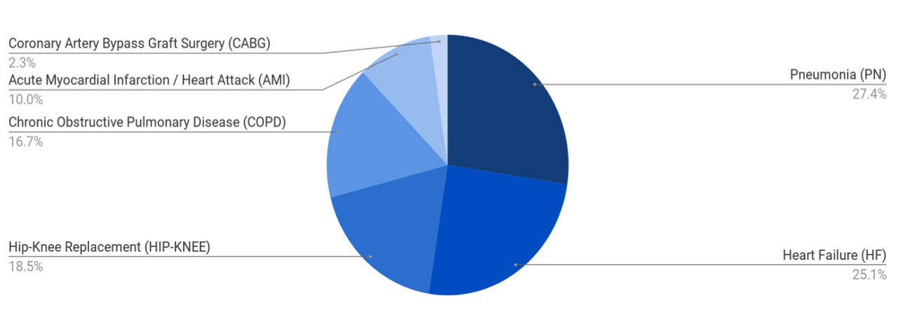
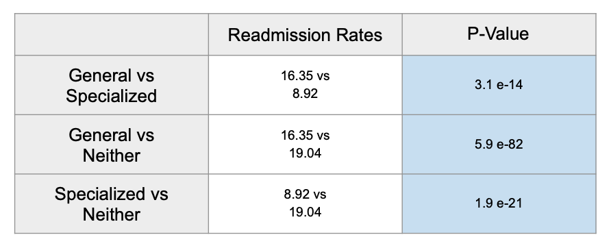
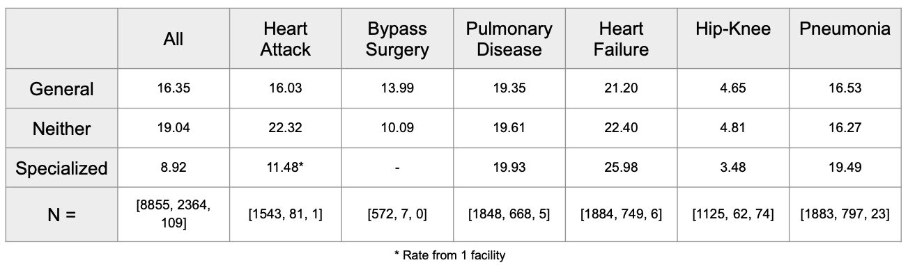
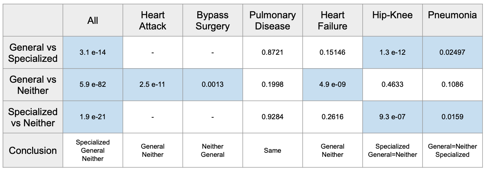

# Hospital Readmissions

I explored a dataset from The Centers of Medicare and Medicaid Services that had information on the number of readmissions for hospitals across the US after treating patients for six different medical conditions. As not every hospital treats each condition, I split the hospitals into three categories: "general" hospitals that treat five or all six of the conditions, "specialized" hospitals that treat one or two of the conditions, and "neither" hospitals that threat three or four of the conditions. I then did hypothesis testing to determine if the rates of readmissioins for these different types are significantly different. Afterwards I further examined readmission rates for each type of hospital by medical condition and did hypothesis testing here too. I also examined readmission rates by state.

## The Data

The data was collected by The Centers for Medicare and Medicaid Services (CMS) and tracks American hospital discharges and readmissions for hospitals serving Medicare patients (65 and older) over the period from 7/01/2015 to 6/30/2018 (3 years).

The data evaluates 3,224 hospitals for their treatment of six different medical conditions, creating 19,344 rows of data (3,224 x 6). Of these, 5,273 rows contained all null values, presumably because the hospital does not treat patients for that condition. Another 2,743 rows were eliminated because the number of readmissions was "Too Few to Report." CMS does not report readmissions if the hospital had less than 25 discharges for that medical condition. This left 11,328 rows with usable data, and 3,052 hospitals to explore.

In addition to a hospital's number of discharges and readmissions for a medical condition, each row also included the state the hospital is located in.

The data can be downloaded [here](https://healthdata.gov/dataset/hospital-readmissions-reduction-program).

I supplemented my analysis with information from the Population Reference Bureau on the 65+ population by state which can be found [here](https://www.prb.org/which-us-states-are-the-oldest/).

## The Six Medical Conditions in Data

Hospitals were evaluated on six different medical condtions: Acute Myocardial Infarction (Heart Attack), Coronary Artery Bypass Graft Surgery, Chronic Obstructive Pulmonary Disease, Heart Failure, Hip/Knee Replacement, and Pneumonia.
    
Below is a chart showing the six medical conditions and the percent for each condition of total patients treated:

## Splitting Hospitals Into Type

As I mentioned, not every hospital treats every condition. Some hospitals treat all six while others treat only one. The bar graph below shows how hospitals treat all six, five, four, three, two, and just one condition. I decided to group the hospitals that treat five or sixe as "general" hospitals, those that treat one or two conditions as "specialized" hospitals, and those that were neither general or specialized as "neither" hospitals.

 
I then calculated the average readmission rate (%, or per 100 patients) for each type of hospital, as seen below.

It looks like specialized hospitals have much lower readmission rates than the other two types, but I wanted to test this theory. 

## Hypothesis Testings

I wanted to do a hypothesis test comparing the readmission rate of specialized and general hospitals.

My **Null Hypothesis** was: There is no difference in the average rate of readmissions for specialized and general hospitals.

And my **Alternative Hypothesis** was: There is a difference in the average rate of readmissions for specialized and general hospitals.

I decided to do a Welch T-test since my sample sizes were so different, and chose an alpha of 0.05.

I also compared both general and specialized hospitals to neither hospitals. The resulting p-values from my test are below.

All three of my p-values were basically zero so it looks like I can reject my null hypotheses and conclude that specialized hospitals have lower readmission rates than general hospitals and both have lower rates than neither hospitals.

But can I? 

I decided to dig a little deeper and explore what might be driving the low readmission rate for specialized hospitals. I calculated readmission rates for each type of hospital by medical condition, as seen below. (The last row shows the number of hospitals for general, neither, and specialized in that order.)

Looking at these numbers, it is clear the large number of specialized hospitals that focus on hip/knee replacements (the medical condition with the lowest readmission rate) is bringing the average readmission rate for specialized hopsitals down. I decided to do hypothesis tests comparing each type of hospital for every medical condition. Below are my p-values.

The above table shows a much more complicated story. I did determine a statically significant difference in specialized hopsitals from both general and neither hospitals that supports specialized hospitals having lower rates (though the difference in rates is not that big). But I also determined specialized hospitals have higher rates or readmissions when treating pneumonia. I was also able to determine statistically significant differences in neither and general hospitals for some of the conditions, but general hospitals do no always have lower rates than neither hospitals.

## State Analysis

Since, the CMS dataset had information about which state the hopsitals were located in, I was able to compare readmission rates by state. Below shows readmission rates by state for each of the six medical conditions. One of the more striking revelations from these charts is how much lower the readmission rates for Utah across all medical conditions seem to be compared to its neighbor Nevada. As a next step, I would want to explore that further. 

The other analysis I did by state was to look at the percentage of people over 65 living in each state who were being treated for these medical condtions. It seems a lot more over 65 year olds (as a percentage of population) are being treated in Kentucky and Mississippi than in other states. More analysis would need to be done to determine why, but a possible reason is a sicker 65+ population.

## Conclusions

Medical conditions matter when determining if the type of hospital has an effect on readmission rates, and in some cases, type of hospital has no effect. Location may also impact readmission rates. 

## Tools Used to Explore and Analyze Data

Python: pandas, numpy, scipy.stats, matplotlib.pyplot, plotly.express
