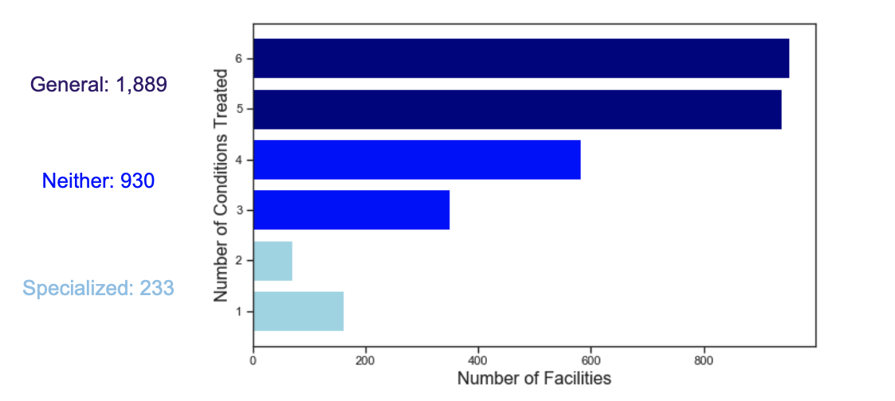

# Hospital Readmissions

I explored a dataset from The Centers of Medicare and Medicaid Services that looked at the number of readmissions hospitals across the US had after treating patients for six different medical conditions. As not every hospital treats each condition, I split the hospitals into three categories: "general" hospitals that treat 5 or all 6 of the conditions, "specialized" hospitals that treat 1 or 2 of the conditions, and "neither" hospitals that threat 3 or 4 of the conditions. I then did hypothesis testing to determine if the rates of readmissioins for these different types are significantly different. Afterwards I further examined readmission rates for each type of hospital by medical condition and did hypothesis testing here too. I also examined readmission rates by state.

## The Data

The data was collected by The Centers for Medicare and Medicaid Services (CMS) and tracks American hospital discharges and readmissions for hospitals serving Medicare patients (65 and older) over the period from 7/01/2015 to 6/30/2018 (3 years).

The data evaluates 3,224 hospitals for their treatment of six different medical conditions, creating 19,344 rows of data (3,224 x 6). Of these, 5,273 rows contained all null values, presumably because the hospital does not treat patients for that condition. Another 2,743 rows were eliminated because the number of readmissions was "Too Few to Report." CMS does not report readmission if the hospital had less than 25. This left 11,328 rows with usable data, and 3,052 hospitals to explore.

In addition to a hospital's number of discharges and readmissions for a medical condition, each row also included the state the hospital is located in.

The data can be downloaded here: https://healthdata.gov/dataset/hospital-readmissions-reduction-program

## The Six Medical Conditions in Data

Hospitals were evaluated on six different medical condtions: Pneumonia, Heart Failure, Hip/Knee Replacement, Chronic Obstructive Pulmonary Disease, Acute Myocardial Infarction (Heart Attack), and Coronary Artery Bypass Graft Surgery.
    
Below is a chart showing the six medical conditions and the percent for each condition of total patients treated:

## Splitting Hospitals Into Type

## Hypothesis Testings

Null Hypothesis:

Alternative Hypothesis:

## State Analysis

## Conclusions

## Tools Used to Explore and Analyze Data
